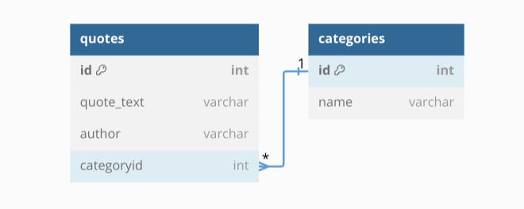

# Quotely App

## Author
Eva Nyakio

## Overview

Quotely is a powerful and user-friendly Command Line Interface (CLI) application designed for anyone seeking daily inspiration. It utilizes an Object-Relational Mapping (ORM) approach without SQLAlchemy, making it efficient and straightforward to manage quotes and categories within a database.It has two models Quote and Category that show case a one to many relationship.

## Getting Started

### Prerequisites
- Python 3.10.12
- SQLite3

### Installation
- Clone this repository.
     git clone https://github.com/Nyakio-Eva/Quotely-CLI-App
     
     cd quotely

### Usage
- To run Quotely, execute the following command:
    python3 cli.py
    
### Database Schema

## Features

### Quotes Management

* Display all quotes- The app allows users to display all quotes stored in the database. This feature provides a comprehensive view of all available quotes.  
* Find quotes by author- Users can search for quotes based on the author's name. This functionality helps users discover quotes attributed to specific authors of interest.
* Find a quote by ID-The app enables users to find a quote using its unique identifier (ID). This feature is useful for quickly accessing a specific quote when its ID is known.
* Find categories by author-Users can find categories associated with quotes by a particular author. This feature helps users explore the different themes covered by an author.
* Create a new quote-Users have the option to create and add a new quote to the database. This feature allows them to contribute new quotes to the collection.
* Update a quote-The app supports updating existing quotes by modifying their text, author, or category. This feature ensures that quotes can be edited to reflect accurate information.
* Delete a quote-Users can also delete quotes from the database. This feature is helpful for removing outdated or irrelevant quotes.

### Categories Management

* Display all categories-The app provides functionality to display all available categories. This feature presents users with a list of categories for organizing quotes.
* Find a category by name-Users can search for a category by its name. This feature helps users quickly locate a specific category of interest.
* Find a category by ID-Similar to finding a category by name, users can also find a category using its unique identifier (ID). This feature provides an alternative method for accessing categories.
* Find quotes by category-Users can discover quotes belonging to a specific category. This feature allows users to explore quotes based on common themes or topics.
* Create a new category-The app allows users to create new categories for organizing quotes. This feature enables users to categorize quotes under relevant genres.
* Update a category-Users have the option to update existing categories by changing their names. This feature ensures that categories can be modified to better suit the organization of quotes.
* Delete a category-Lastly, users can delete categories from the database. This feature is useful for removing outdated or unnecessary categories.

***By providing these functionalities,  Quotely CLI app offers a comprehensive system for managing quotes and categories, enhancing user experience and organization of quote-related data.***

### Support

For any issues, feedback, or questions, please contact the Quotely team at evalkariuki@gmail.com.

Enjoy your daily dose of inspiration with Quotely! 🌟

